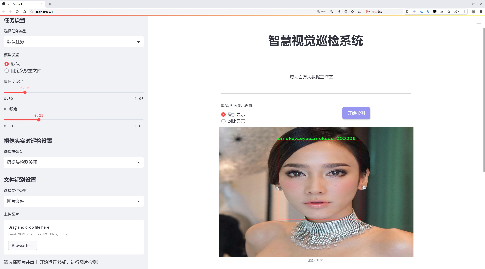
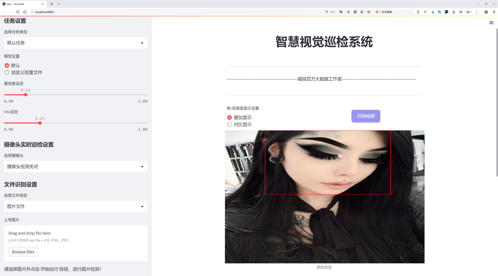
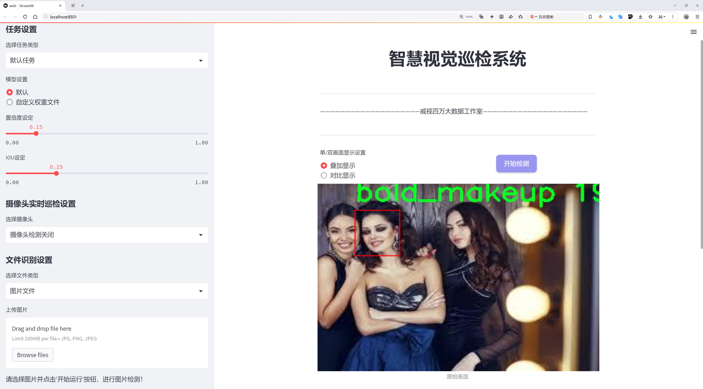
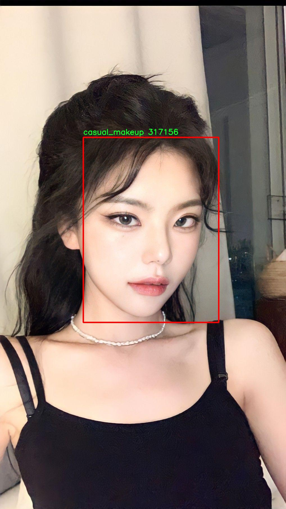
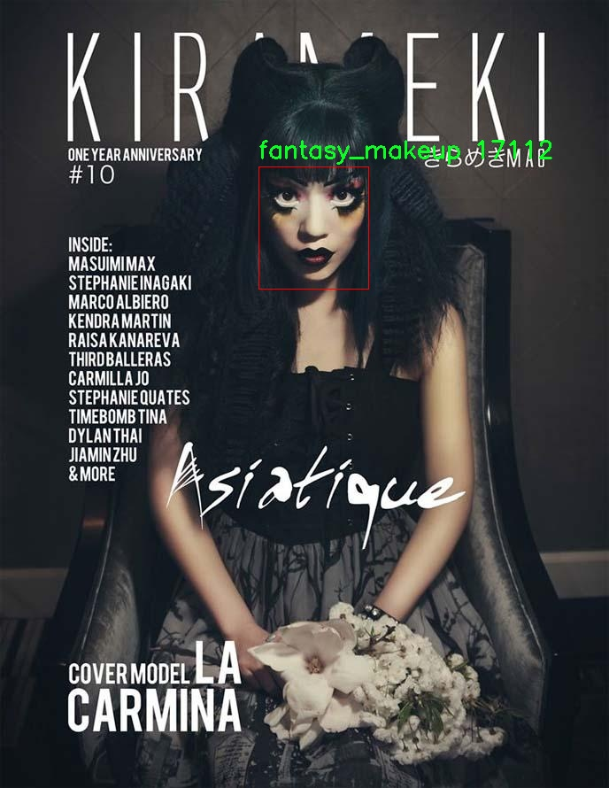
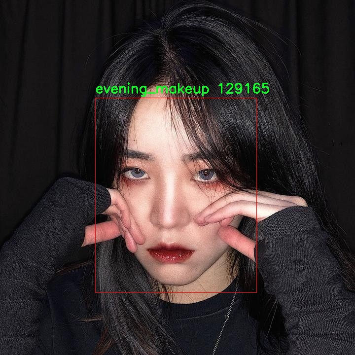
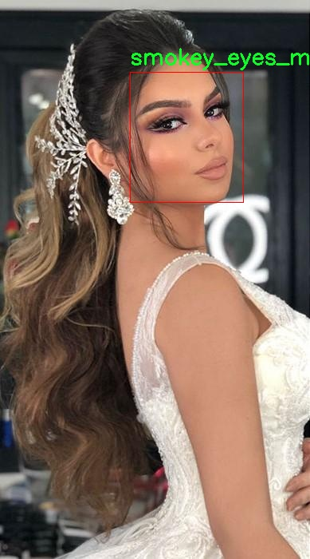
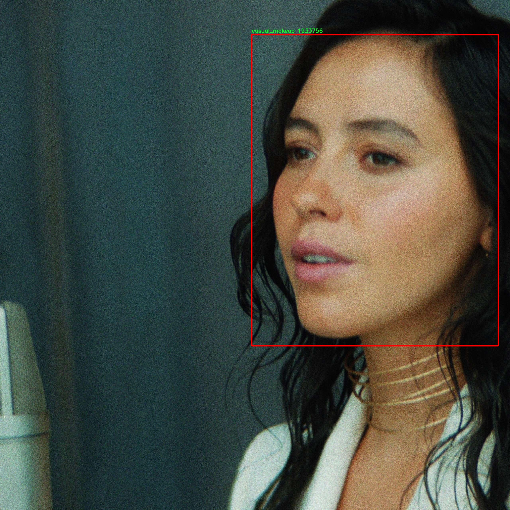

# 化妆风格识别检测系统源码分享
 # [一条龙教学YOLOV8标注好的数据集一键训练_70+全套改进创新点发刊_Web前端展示]

### 1.研究背景与意义

项目参考[AAAI Association for the Advancement of Artificial Intelligence](https://gitee.com/qunshansj/projects)

项目来源[AACV Association for the Advancement of Computer Vision](https://gitee.com/qunmasj/projects)

研究背景与意义

随着社会的发展和科技的进步，化妆不仅仅是一种个人审美的体现，更成为了文化表达和社会交往的重要工具。化妆风格的多样性使得其在时尚、影视、广告等领域的应用愈加广泛，然而，如何准确识别和分类不同的化妆风格却成为了一个亟待解决的问题。传统的化妆风格识别方法往往依赖于人工特征提取和规则定义，难以适应快速变化的时尚潮流和个性化需求。因此，基于深度学习的自动化识别系统应运而生，成为了研究的热点。

YOLO（You Only Look Once）系列模型以其高效的实时目标检测能力在计算机视觉领域获得了广泛应用。YOLOv8作为该系列的最新版本，凭借其在速度和精度上的显著提升，成为了实现化妆风格识别的理想选择。然而，尽管YOLOv8在目标检测任务中表现优异，但在特定领域如化妆风格识别中，仍然面临着一些挑战。例如，化妆风格的多样性和复杂性使得模型在不同风格之间的区分变得更加困难，尤其是在风格交叉和模糊的情况下。因此，改进YOLOv8以适应化妆风格识别的需求，具有重要的研究意义。

本研究将基于9141张图像的化妆风格数据集，涵盖了8种不同的化妆风格，包括大胆妆容、休闲妆容、晚宴魅力妆容、晚宴妆容、幻想妆容、无妆容、烟熏妆容和复古妆容。这些类别不仅反映了化妆风格的多样性，也为模型的训练和测试提供了丰富的样本。在数据集的支持下，研究将通过改进YOLOv8模型，提升其在化妆风格识别任务中的表现。具体而言，将通过优化网络结构、调整损失函数、引入数据增强技术等手段，提升模型对不同化妆风格的识别能力和准确性。

本研究的意义不仅在于推动化妆风格识别技术的发展，更在于为相关行业提供实用的技术支持。随着社交媒体和电子商务的兴起，消费者对化妆风格的需求日益增加，准确的化妆风格识别系统能够为用户提供个性化的化妆建议和产品推荐，提升用户体验。此外，该技术还可以应用于虚拟试妆、智能化妆镜等领域，推动化妆行业的数字化转型。

综上所述，基于改进YOLOv8的化妆风格识别系统的研究，不仅具有重要的理论价值，也具备广泛的应用前景。通过深入探索化妆风格的特征和表现形式，推动深度学习技术在化妆领域的应用，将为未来的化妆风格识别研究奠定坚实的基础。

### 2.图片演示







##### 注意：由于此博客编辑较早，上面“2.图片演示”和“3.视频演示”展示的系统图片或者视频可能为老版本，新版本在老版本的基础上升级如下：（实际效果以升级的新版本为准）

  （1）适配了YOLOV8的“目标检测”模型和“实例分割”模型，通过加载相应的权重（.pt）文件即可自适应加载模型。

  （2）支持“图片识别”、“视频识别”、“摄像头实时识别”三种识别模式。

  （3）支持“图片识别”、“视频识别”、“摄像头实时识别”三种识别结果保存导出，解决手动导出（容易卡顿出现爆内存）存在的问题，识别完自动保存结果并导出到tempDir中。

  （4）支持Web前端系统中的标题、背景图等自定义修改，后面提供修改教程。

  另外本项目提供训练的数据集和训练教程,暂不提供权重文件（best.pt）,需要您按照教程进行训练后实现图片演示和Web前端界面演示的效果。

### 3.视频演示

[3.1 视频演示](https://www.bilibili.com/video/BV14utXeREv2/)

### 4.数据集信息展示

##### 4.1 本项目数据集详细数据（类别数＆类别名）

nc: 8
names: ['bold_makeup', 'casual_makeup', 'evening_glamour_makeup', 'evening_makeup', 'fantasy_makeup', 'no_makeup', 'smokey_eyes_makeup', 'vintage_makeup']


##### 4.2 本项目数据集信息介绍

数据集信息展示

在当今快速发展的化妆品行业中，化妆风格的识别与分类成为了计算机视觉领域的重要研究方向之一。为此，我们构建了一个名为“makeup”的数据集，旨在为改进YOLOv8的化妆风格识别系统提供强有力的支持。该数据集包含了八种不同的化妆风格，涵盖了从日常妆容到特殊场合妆容的多样性，充分体现了现代女性在不同场合下的化妆需求。

“makeup”数据集的类别数量为8，具体包括：大胆妆容（bold_makeup）、休闲妆容（casual_makeup）、晚宴魅力妆容（evening_glamour_makeup）、晚宴妆容（evening_makeup）、幻想妆容（fantasy_makeup）、无妆容（no_makeup）、烟熏眼妆（smokey_eyes_makeup）以及复古妆容（vintage_makeup）。这些类别不仅展示了化妆风格的多样性，还反映了不同文化和社交场合对妆容的不同需求。

在数据集的构建过程中，我们特别注重样本的多样性和代表性。每种化妆风格都包含了大量的图像数据，确保模型在训练时能够学习到丰富的特征信息。例如，大胆妆容通常强调鲜艳的色彩和夸张的妆效，而休闲妆容则更倾向于自然和简约的风格。晚宴妆容和晚宴魅力妆容则侧重于在正式场合中展现优雅与魅力，常常使用闪亮的眼影和精致的唇妆。幻想妆容则打破了传统的界限，融入了更多的创意元素，适合于节日或主题派对。而无妆容则是对自然美的追求，强调肌肤的健康状态。

为了确保数据集的质量，我们对每一类妆容进行了严格的筛选和标注，确保图像的清晰度和标注的准确性。每张图像都经过专业化妆师的审核，以确保其符合相应的妆容标准。此外，数据集中的图像来源于不同的肤色、性别和年龄段，力求在训练过程中消除偏见，使得模型能够在多样化的输入下表现出色。

在使用YOLOv8进行训练时，数据集的多样性将有助于模型更好地理解和识别不同的化妆风格。YOLOv8作为一种先进的目标检测算法，能够在保持高精度的同时实现快速的推理速度，这使得它非常适合实时化妆风格识别的应用场景。通过对“makeup”数据集的训练，模型将能够在实际应用中快速、准确地识别出用户所选择的化妆风格，从而为用户提供个性化的化妆建议和产品推荐。

总之，“makeup”数据集不仅为化妆风格识别的研究提供了丰富的资源，也为相关技术的进步奠定了基础。随着深度学习技术的不断发展，我们期待该数据集能够推动化妆风格识别领域的进一步研究与应用，助力更多女性在日常生活中展现自信与美丽。











### 5.全套项目环境部署视频教程（零基础手把手教学）

[5.1 环境部署教程链接（零基础手把手教学）](https://www.ixigua.com/7404473917358506534?logTag=c807d0cbc21c0ef59de5)


[5.2 安装Python虚拟环境创建和依赖库安装视频教程链接（零基础手把手教学）](https://www.ixigua.com/7404474678003106304?logTag=1f1041108cd1f708b01a)

### 6.手把手YOLOV8训练视频教程（零基础小白有手就能学会）

[6.1 手把手YOLOV8训练视频教程（零基础小白有手就能学会）](https://www.ixigua.com/7404477157818401292?logTag=d31a2dfd1983c9668658)

### 7.70+种全套YOLOV8创新点代码加载调参视频教程（一键加载写好的改进模型的配置文件）

[7.1 70+种全套YOLOV8创新点代码加载调参视频教程（一键加载写好的改进模型的配置文件）](https://www.ixigua.com/7404478314661806627?logTag=29066f8288e3f4eea3a4)

### 8.70+种全套YOLOV8创新点原理讲解（非科班也可以轻松写刊发刊，V10版本正在科研待更新）

由于篇幅限制，每个创新点的具体原理讲解就不一一展开，具体见下列网址中的创新点对应子项目的技术原理博客网址【Blog】：


[8.1 70+种全套YOLOV8创新点原理讲解链接](https://gitee.com/qunmasj/good)

### 9.系统功能展示（检测对象为举例，实际内容以本项目数据集为准）

图9.1.系统支持检测结果表格显示

  图9.2.系统支持置信度和IOU阈值手动调节

  图9.3.系统支持自定义加载权重文件best.pt(需要你通过步骤5中训练获得)

  图9.4.系统支持摄像头实时识别

  图9.5.系统支持图片识别

  图9.6.系统支持视频识别

  图9.7.系统支持识别结果文件自动保存

  图9.8.系统支持Excel导出检测结果数据


### 10.原始YOLOV8算法原理

原始YOLOv8算法原理

YOLOv8算法是由Ultralytics公司于2023年1月10日推出的最新版本，标志着YOLO系列目标检测算法的又一次重大进步。作为YOLOv7的改进版，YOLOv8在多个方面进行了优化，旨在提升目标检测的精度和速度。该算法的核心理念是通过深度卷积神经网络结构直接对整个图像进行处理，而无需使用传统的滑动窗口或区域提议方法，这一创新显著提高了检测的效率和准确性。

YOLOv8的网络结构分为三个主要部分：Backbone、Neck和Head。Backbone部分负责特征提取，采用了一系列卷积和反卷积层，通过残差连接和瓶颈结构来减小网络的复杂度并提升性能。具体而言，Backbone部分由多个CBS模块、C2f模块和一个快速空间金字塔池化（SPPF）模块组成，这些模块共同作用，使得网络能够有效地提取多层次的特征信息。

在特征提取完成后，Neck部分通过多尺度特征融合技术，将来自Backbone不同阶段的特征图进行整合。这一过程对于捕捉不同尺度的目标信息至关重要，因为目标在图像中的大小和形状各异，尤其是在复杂场景中，单一尺度的特征可能无法有效地识别所有目标。通过融合不同尺度的特征，YOLOv8显著提高了目标检测的鲁棒性和准确性。

最后，Head部分负责最终的目标检测和分类任务。YOLOv8设计了三个检测头，以便在不同的尺寸信息下进行目标检测。这些检测头通过一系列卷积层和反卷积层，利用前面提取的特征，生成最终的检测结果。这样的设计使得YOLOv8能够在处理复杂场景时，依然保持高效的检测性能。

YOLOv8在算法性能上有了显著提升，尤其是在精度和帧率方面。与SSD算法相比，YOLOv8的精度提高了43.23%，帧率提升了10.28倍，这一变化使得YOLOv8在实际应用中表现出色，尤其是在智能监控、自动驾驶和人脸识别等领域。其优越的性能使得YOLOv8成为了当前业界最流行和成功的目标检测算法之一。

值得注意的是，YOLOv8提供了五种不同的网络结构，包括YOLOv8n、YOLOv8s、YOLOv8m、YOLOv8l和YOLOv8x。这些结构的主要区别在于Backbone的层数和残差块的数量，但基本原理保持一致。这种灵活性使得用户可以根据具体的应用需求和硬件条件，选择最合适的模型进行训练和部署。

在模型设置方面，YOLOv8引入了depth_factor、width_factor和ratio等参数，允许用户根据需求调整模型的深度和宽度。通过设置较大的depth_factor和width_factor，网络可以按比例变深和变宽，从而适应更复杂的任务；反之，设置较小的值则使得网络变浅和变窄，以适应轻量级应用。具体来说，YOLOv8的C5基础通道数为512，最大通道数设置为1024、768或512，用户可以根据实际需求灵活调整。

综上所述，YOLOv8算法在目标检测领域展现了卓越的性能和灵活性。其深度卷积神经网络结构、有效的特征提取与融合机制，以及多样化的模型选择，使得YOLOv8能够在各种复杂场景中实现高效、准确的目标检测。这些优势不仅提升了算法的实用性，也为后续的研究和应用提供了广阔的空间。因此，YOLOv8无疑是当前目标检测技术的一个重要里程碑，为智能监控、自动驾驶等领域的应用奠定了坚实的基础。


### 11.项目核心源码讲解（再也不用担心看不懂代码逻辑）

#### 11.1 code\ultralytics\models\fastsam\val.py

以下是经过精简和注释的核心代码部分：

```python
# 导入必要的模块
from ultralytics.models.yolo.segment import SegmentationValidator
from ultralytics.utils.metrics import SegmentMetrics

class FastSAMValidator(SegmentationValidator):
    """
    自定义验证类，用于快速SAM（Segment Anything Model）分割，基于Ultralytics YOLO框架。

    该类扩展了SegmentationValidator，专门定制了快速SAM的验证过程。将任务设置为“分割”，并使用SegmentMetrics进行评估。
    此外，为避免在验证过程中出现错误，禁用了绘图功能。
    """

    def __init__(self, dataloader=None, save_dir=None, pbar=None, args=None, _callbacks=None):
        """
        初始化FastSAMValidator类，将任务设置为“分割”，并将指标设置为SegmentMetrics。

        参数:
            dataloader (torch.utils.data.DataLoader): 用于验证的数据加载器。
            save_dir (Path, optional): 保存结果的目录。
            pbar (tqdm.tqdm): 用于显示进度的进度条。
            args (SimpleNamespace): 验证器的配置。
            _callbacks (dict): 存储各种回调函数的字典。

        注意:
            禁用ConfusionMatrix和其他相关指标的绘图，以避免错误。
        """
        # 调用父类构造函数进行初始化
        super().__init__(dataloader, save_dir, pbar, args, _callbacks)
        
        # 设置任务类型为“分割”
        self.args.task = "segment"
        
        # 禁用绘图功能以避免错误
        self.args.plots = False
        
        # 初始化分割指标
        self.metrics = SegmentMetrics(save_dir=self.save_dir, on_plot=self.on_plot)
```

### 代码核心部分分析：

1. **类定义**：
   - `FastSAMValidator`类继承自`SegmentationValidator`，用于快速SAM模型的分割验证。

2. **构造函数**：
   - `__init__`方法用于初始化验证器，设置任务类型和指标。
   - `dataloader`参数用于提供验证数据。
   - `save_dir`参数指定结果保存的目录。
   - `pbar`用于显示验证进度。
   - `args`用于传递配置参数。
   - `_callbacks`用于存储回调函数。

3. **属性设置**：
   - `self.args.task`设置为“segment”，表示当前任务为分割。
   - `self.args.plots`被设置为`False`，禁用绘图功能，以避免在验证过程中出现错误。
   - `self.metrics`使用`SegmentMetrics`来评估分割结果，指定保存目录和绘图选项。

通过这些核心部分，`FastSAMValidator`能够在Ultralytics YOLO框架中有效地进行分割验证。

这个文件定义了一个名为 `FastSAMValidator` 的类，继承自 `SegmentationValidator`，用于在 Ultralytics YOLO 框架中进行快速 SAM（Segment Anything Model）分割的自定义验证。该类主要用于设置分割任务，并使用 `SegmentMetrics` 进行评估，同时禁用绘图功能以避免在验证过程中出现错误。

在类的文档字符串中，详细描述了该类的功能和属性。主要属性包括数据加载器 `dataloader`，用于验证的数据目录 `save_dir`，进度条对象 `pbar`，以及其他可选的参数 `args` 和回调函数 `_callbacks`。

在 `__init__` 方法中，初始化了 `FastSAMValidator` 类，首先调用父类的构造函数以设置基础属性。接着，将任务类型设置为“segment”，并禁用绘图功能，以避免在验证过程中出现与混淆矩阵和其他相关指标绘图相关的错误。此外，实例化了 `SegmentMetrics`，用于在验证过程中计算和存储分割性能指标。

总的来说，这个文件的主要目的是为快速 SAM 模型的分割任务提供一个专门的验证类，确保在验证过程中能够正确地评估模型性能，同时避免不必要的错误。

#### 11.2 ui.py

```python
import sys
import subprocess

def run_script(script_path):
    """
    使用当前 Python 环境运行指定的脚本。

    Args:
        script_path (str): 要运行的脚本路径

    Returns:
        None
    """
    # 获取当前 Python 解释器的路径
    python_path = sys.executable

    # 构建运行命令，使用 streamlit 运行指定的脚本
    command = f'"{python_path}" -m streamlit run "{script_path}"'

    # 执行命令
    result = subprocess.run(command, shell=True)
    # 检查命令执行结果，如果返回码不为0，则表示出错
    if result.returncode != 0:
        print("脚本运行出错。")


# 实例化并运行应用
if __name__ == "__main__":
    # 指定要运行的脚本路径
    script_path = "web.py"  # 这里可以直接指定脚本名

    # 调用函数运行脚本
    run_script(script_path)
```

### 代码核心部分注释：
1. **导入模块**：
   - `sys`：用于获取当前 Python 解释器的路径。
   - `subprocess`：用于执行外部命令。

2. **`run_script` 函数**：
   - 定义一个函数 `run_script`，接受一个参数 `script_path`，表示要运行的脚本路径。
   - 使用 `sys.executable` 获取当前 Python 解释器的路径，以确保使用正确的 Python 环境。
   - 构建命令字符串，使用 `streamlit` 模块运行指定的脚本。
   - 使用 `subprocess.run` 执行构建的命令，并检查返回码以判断脚本是否成功运行。

3. **主程序入口**：
   - 使用 `if __name__ == "__main__":` 确保只有在直接运行该脚本时才会执行以下代码。
   - 指定要运行的脚本路径（这里是 `web.py`）。
   - 调用 `run_script` 函数，传入脚本路径以执行该脚本。

这个程序文件的主要功能是通过当前的 Python 环境来运行一个指定的脚本，具体来说是运行一个名为 `web.py` 的脚本。程序首先导入了必要的模块，包括 `sys`、`os` 和 `subprocess`，以及一个自定义的路径处理模块 `abs_path`。

在 `run_script` 函数中，首先获取当前 Python 解释器的路径，这通过 `sys.executable` 实现。接着，构建一个命令字符串，这个命令用于调用 `streamlit` 来运行指定的脚本。命令的格式是将 Python 解释器的路径与 `-m streamlit run` 以及脚本路径结合起来，形成一个完整的命令。

然后，使用 `subprocess.run` 方法来执行这个命令。`shell=True` 参数表示在一个新的 shell 中执行命令。执行后，程序会检查返回的状态码，如果状态码不为 0，说明脚本运行过程中出现了错误，程序会打印出相应的错误信息。

在文件的最后部分，使用 `if __name__ == "__main__":` 语句来确保只有在直接运行该文件时才会执行下面的代码。在这里，首先调用 `abs_path` 函数来获取 `web.py` 的绝对路径，然后调用 `run_script` 函数来运行这个脚本。

总的来说，这个程序提供了一种简单的方式来运行指定的 Python 脚本，并且能够处理可能出现的错误。

#### 11.3 code\ultralytics\data\explorer\__init__.py

以下是保留的核心代码部分，并添加了详细的中文注释：

```python
# 导入Ultralytics YOLO库中的plot_query_result函数
from .utils import plot_query_result

# 定义该模块公开的接口，包含plot_query_result函数
__all__ = ["plot_query_result"]
```

### 代码注释说明：
1. `from .utils import plot_query_result`：从当前模块的utils子模块中导入`plot_query_result`函数。这个函数可能用于绘制查询结果，具体功能依赖于utils模块的实现。
  
2. `__all__ = ["plot_query_result"]`：定义了模块的公开接口，指定当使用`from module import *`时，只有`plot_query_result`函数会被导入。这是一种控制模块导出内容的方式，有助于避免命名冲突和保护内部实现细节。

这个程序文件是一个Python模块，属于Ultralytics YOLO项目的一部分。文件的开头有一个注释，表明该项目使用的是AGPL-3.0许可证，并且与Ultralytics YOLO相关。

在代码中，首先从当前包（即同一目录下）导入了一个名为`plot_query_result`的函数或类。这意味着`plot_query_result`的实现是在`utils`模块中。接下来，`__all__`变量被定义为一个列表，包含了字符串`"plot_query_result"`。这个变量的作用是控制从该模块中导入的内容，当使用`from module import *`语句时，只会导入`__all__`中列出的名称。

综上所述，这个文件的主要功能是将`plot_query_result`函数或类暴露给其他模块使用，同时确保代码的结构清晰和可维护。

#### 11.4 code\ultralytics\solutions\ai_gym.py

以下是代码中最核心的部分，并附上详细的中文注释：

```python
import cv2
from ultralytics.utils.checks import check_imshow
from ultralytics.utils.plotting import Annotator

class AIGym:
    """用于管理基于姿势的实时视频流中人们健身动作的类。"""

    def __init__(self):
        """初始化AIGym，设置视觉和图像参数的默认值。"""
        self.im0 = None  # 当前帧图像
        self.tf = None   # 线条厚度

        # 关键点和计数信息
        self.keypoints = None  # 姿势关键点
        self.poseup_angle = None  # 上升姿势的角度
        self.posedown_angle = None  # 下降姿势的角度
        self.threshold = 0.001  # 阈值

        # 存储阶段、计数和角度信息
        self.angle = None  # 当前角度
        self.count = None  # 当前计数
        self.stage = None  # 当前阶段
        self.pose_type = "pushup"  # 姿势类型，默认为俯卧撑
        self.kpts_to_check = None  # 需要检查的关键点

        # 视觉信息
        self.view_img = False  # 是否显示图像
        self.annotator = None  # 注释器对象

        # 检查环境是否支持imshow
        self.env_check = check_imshow(warn=True)

    def set_args(self, kpts_to_check, line_thickness=2, view_img=False, pose_up_angle=145.0, pose_down_angle=90.0, pose_type="pullup"):
        """
        配置AIGym的参数
        Args:
            kpts_to_check (list): 用于计数的3个关键点
            line_thickness (int): 边界框的线条厚度
            view_img (bool): 是否显示im0
            pose_up_angle (float): 设置上升姿势的角度
            pose_down_angle (float): 设置下降姿势的角度
            pose_type: "pushup", "pullup" 或 "abworkout"
        """
        self.kpts_to_check = kpts_to_check  # 设置需要检查的关键点
        self.tf = line_thickness  # 设置线条厚度
        self.view_img = view_img  # 设置是否显示图像
        self.poseup_angle = pose_up_angle  # 设置上升姿势的角度
        self.posedown_angle = pose_down_angle  # 设置下降姿势的角度
        self.pose_type = pose_type  # 设置姿势类型

    def start_counting(self, im0, results, frame_count):
        """
        计数健身动作的函数
        Args:
            im0 (ndarray): 当前视频流的帧
            results: 姿势估计数据
            frame_count: 当前帧计数
        """
        self.im0 = im0  # 更新当前帧图像
        if frame_count == 1:
            # 初始化计数、角度和阶段
            self.count = [0] * len(results[0])
            self.angle = [0] * len(results[0])
            self.stage = ["-" for _ in results[0]]
        
        self.keypoints = results[0].keypoints.data  # 获取关键点数据
        self.annotator = Annotator(im0, line_width=2)  # 创建注释器对象

        num_keypoints = len(results[0])  # 获取关键点数量

        # 如果关键点数量发生变化，调整角度、计数和阶段的大小
        if len(self.angle) != num_keypoints:
            self.angle = [0] * num_keypoints
            self.count = [0] * num_keypoints
            self.stage = ["-" for _ in range(num_keypoints)]

        # 遍历每个关键点
        for ind, k in enumerate(reversed(self.keypoints)):
            # 根据姿势类型计算角度和更新计数
            self.angle[ind] = self.annotator.estimate_pose_angle(
                k[int(self.kpts_to_check[0])].cpu(),
                k[int(self.kpts_to_check[1])].cpu(),
                k[int(self.kpts_to_check[2])].cpu(),
            )
            self.im0 = self.annotator.draw_specific_points(k, self.kpts_to_check, shape=(640, 640), radius=10)

            # 根据姿势类型更新阶段和计数
            if self.pose_type == "pushup":
                if self.angle[ind] > self.poseup_angle:
                    self.stage[ind] = "up"
                if self.angle[ind] < self.posedown_angle and self.stage[ind] == "up":
                    self.stage[ind] = "down"
                    self.count[ind] += 1

            elif self.pose_type == "pullup":
                if self.angle[ind] > self.poseup_angle:
                    self.stage[ind] = "down"
                if self.angle[ind] < self.posedown_angle and self.stage[ind] == "down":
                    self.stage[ind] = "up"
                    self.count[ind] += 1

            # 绘制角度、计数和阶段信息
            self.annotator.plot_angle_and_count_and_stage(
                angle_text=self.angle[ind],
                count_text=self.count[ind],
                stage_text=self.stage[ind],
                center_kpt=k[int(self.kpts_to_check[1])],
                line_thickness=self.tf,
            )

            # 绘制关键点
            self.annotator.kpts(k, shape=(640, 640), radius=1, kpt_line=True)

        # 如果环境支持imshow并且需要显示图像，则显示当前帧
        if self.env_check and self.view_img:
            cv2.imshow("Ultralytics YOLOv8 AI GYM", self.im0)
            if cv2.waitKey(1) & 0xFF == ord("q"):
                return

        return self.im0  # 返回当前帧图像

if __name__ == "__main__":
    AIGym()  # 创建AIGym实例
```

### 代码核心部分解释：
1. **类初始化**：`__init__` 方法中初始化了一些基本参数，包括图像、线条厚度、关键点、角度、计数和阶段等信息。
2. **参数设置**：`set_args` 方法用于配置需要检查的关键点、线条厚度、是否显示图像以及姿势的上下角度和类型。
3. **计数逻辑**：`start_counting` 方法是核心逻辑，负责处理每一帧图像，计算姿势角度，更新计数和阶段，并在图像上绘制相关信息。根据不同的姿势类型（俯卧撑、引体向上等）来更新计数和阶段。
4. **图像显示**：如果环境支持并且设置为显示图像，则使用 OpenCV 显示当前帧图像。

这个程序文件定义了一个名为 `AIGym` 的类，旨在通过实时视频流监测和计数人们的健身动作，主要是针对不同的姿势（如俯卧撑、引体向上和腹部锻炼）进行分析。程序的核心功能包括姿势角度的估计、动作计数和实时可视化。

在 `AIGym` 类的初始化方法中，定义了一些默认参数和变量，包括图像、关键点、姿势角度、计数、阶段等信息。特别地，`pose_type` 用于指定当前的健身动作类型，初始设置为 "pushup"（俯卧撑）。此外，程序还通过 `check_imshow` 函数检查当前环境是否支持图像显示。

`set_args` 方法用于配置类的参数，包括需要检查的关键点、线条厚度、是否显示图像、上升和下降的角度阈值以及姿势类型。这些参数将影响后续的姿势检测和计数逻辑。

`start_counting` 方法是程序的核心功能，负责从视频流中获取当前帧并进行姿势计数。它首先更新当前帧的图像和关键点数据。如果是第一帧，则初始化计数、角度和阶段信息。接着，程序会根据当前姿势类型（如俯卧撑、引体向上或腹部锻炼）来估计关键点之间的角度，并根据角度的变化来判断动作的阶段（上升或下降），同时更新计数。

在每个动作的判断中，程序会根据设定的角度阈值来决定动作的状态，并在图像上绘制相应的关键点、角度、计数和阶段信息。最后，如果环境支持图像显示并且设置了显示图像的参数，程序会使用 OpenCV 显示当前帧图像，并在按下 "q" 键时退出。

整个程序的设计旨在实时分析和反馈用户的健身动作，通过视觉化的方式帮助用户更好地进行锻炼。

#### 11.5 code\ultralytics\trackers\track.py

以下是代码中最核心的部分，并附上详细的中文注释：

```python
# 导入必要的库
from functools import partial
from pathlib import Path
import torch
from ultralytics.utils import IterableSimpleNamespace, yaml_load
from ultralytics.utils.checks import check_yaml
from .bot_sort import BOTSORT
from .byte_tracker import BYTETracker

# 跟踪器类型与对应的跟踪器类的映射
TRACKER_MAP = {"bytetrack": BYTETracker, "botsort": BOTSORT}

def on_predict_start(predictor: object, persist: bool = False) -> None:
    """
    在预测开始时初始化对象跟踪器。

    参数:
        predictor (object): 要为其初始化跟踪器的预测器对象。
        persist (bool, optional): 如果跟踪器已经存在，是否保持其状态。默认为 False。

    异常:
        AssertionError: 如果 tracker_type 不是 'bytetrack' 或 'botsort'。
    """
    # 检查任务类型是否为 OBB（方向性边界框），如果是则抛出异常
    if predictor.args.task == "obb":
        raise NotImplementedError("ERROR ❌ OBB task does not support track mode!")
    
    # 如果预测器已经有跟踪器并且需要保持状态，则直接返回
    if hasattr(predictor, "trackers") and persist:
        return

    # 检查并加载跟踪器的配置文件
    tracker = check_yaml(predictor.args.tracker)
    cfg = IterableSimpleNamespace(**yaml_load(tracker))

    # 确保跟踪器类型是支持的类型
    if cfg.tracker_type not in ["bytetrack", "botsort"]:
        raise AssertionError(f"Only 'bytetrack' and 'botsort' are supported for now, but got '{cfg.tracker_type}'")

    # 初始化跟踪器列表
    trackers = []
    for _ in range(predictor.dataset.bs):  # 根据批次大小创建跟踪器
        tracker = TRACKER_MAP[cfg.tracker_type](args=cfg, frame_rate=30)
        trackers.append(tracker)
    
    # 将创建的跟踪器分配给预测器
    predictor.trackers = trackers

def on_predict_postprocess_end(predictor: object, persist: bool = False) -> None:
    """
    后处理检测到的框并更新对象跟踪。

    参数:
        predictor (object): 包含预测结果的预测器对象。
        persist (bool, optional): 如果跟踪器已经存在，是否保持其状态。默认为 False。
    """
    bs = predictor.dataset.bs  # 批次大小
    path, im0s = predictor.batch[:2]  # 获取路径和图像数据

    for i in range(bs):
        # 如果不是持久化且是新视频，则重置跟踪器
        if not persist and predictor.vid_path[i] != str(predictor.save_dir / Path(path[i]).name):
            predictor.trackers[i].reset()

        # 获取检测到的框
        det = predictor.results[i].boxes.cpu().numpy()
        if len(det) == 0:  # 如果没有检测到框，则跳过
            continue
        
        # 更新跟踪器并获取跟踪结果
        tracks = predictor.trackers[i].update(det, im0s[i])
        if len(tracks) == 0:  # 如果没有跟踪结果，则跳过
            continue
        
        # 更新预测结果，只保留跟踪到的框
        idx = tracks[:, -1].astype(int)
        predictor.results[i] = predictor.results[i][idx]
        predictor.results[i].update(boxes=torch.as_tensor(tracks[:, :-1]))  # 更新框信息

def register_tracker(model: object, persist: bool) -> None:
    """
    为模型注册跟踪回调，以便在预测期间进行对象跟踪。

    参数:
        model (object): 要为其注册跟踪回调的模型对象。
        persist (bool): 如果跟踪器已经存在，是否保持其状态。
    """
    # 注册预测开始时的回调
    model.add_callback("on_predict_start", partial(on_predict_start, persist=persist))
    # 注册后处理结束时的回调
    model.add_callback("on_predict_postprocess_end", partial(on_predict_postprocess_end, persist=persist))
```

### 代码核心部分说明：
1. **跟踪器初始化**：`on_predict_start` 函数用于在预测开始时初始化跟踪器，确保使用的跟踪器类型是支持的，并根据批次大小创建相应数量的跟踪器实例。
2. **后处理跟踪**：`on_predict_postprocess_end` 函数用于在预测后处理阶段更新检测到的框，并将跟踪结果应用到预测结果中。
3. **回调注册**：`register_tracker` 函数用于将上述两个函数注册为模型的回调，以便在预测过程中自动调用。

这个程序文件是用于实现目标跟踪功能的，主要是与Ultralytics YOLO模型结合使用的。文件中包含了一些重要的函数和类，主要用于在预测过程中初始化和管理目标跟踪器。

首先，文件导入了一些必要的库和模块，包括`torch`和一些Ultralytics的工具函数。然后，定义了一个映射字典`TRACKER_MAP`，将跟踪器类型（如“bytetrack”和“botsort”）映射到相应的跟踪器类。这些跟踪器类负责实现具体的目标跟踪算法。

接下来，定义了`on_predict_start`函数，该函数在预测开始时被调用，用于初始化目标跟踪器。函数接受一个预测器对象和一个可选的持久化参数。如果任务类型是“obb”，则抛出一个未实现的错误，因为该模式不支持目标跟踪。如果预测器已经有跟踪器并且持久化参数为真，则直接返回。然后，函数会检查配置文件中的跟踪器类型，确保其为支持的类型之一。如果不符合要求，则抛出一个断言错误。接着，函数会为每个批次的图像创建相应的跟踪器实例，并将其存储在预测器对象中。

`on_predict_postprocess_end`函数在预测后处理结束时被调用，用于更新检测到的目标框并进行目标跟踪。该函数首先获取批次大小和图像数据，然后遍历每个图像。如果持久化参数为假且视频路径不同，则重置相应的跟踪器。接着，函数获取检测结果，并检查是否有检测到的目标。如果没有，则跳过该图像。如果有检测到的目标，调用跟踪器的`update`方法进行跟踪，并更新预测结果。

最后，`register_tracker`函数用于将跟踪回调注册到模型中，以便在预测过程中调用。该函数接受模型对象和持久化参数，并使用`add_callback`方法将`on_predict_start`和`on_predict_postprocess_end`函数注册为回调。

整体来看，这个文件的主要功能是为YOLO模型提供目标跟踪的支持，通过初始化和管理不同类型的跟踪器来实现对目标的持续跟踪。

#### 11.6 train.py

以下是经过简化和注释的核心代码部分：

```python
import random
import numpy as np
import torch.nn as nn
from ultralytics.data import build_dataloader, build_yolo_dataset
from ultralytics.engine.trainer import BaseTrainer
from ultralytics.models import yolo
from ultralytics.nn.tasks import DetectionModel
from ultralytics.utils import LOGGER, RANK
from ultralytics.utils.torch_utils import de_parallel, torch_distributed_zero_first

class DetectionTrainer(BaseTrainer):
    """
    基于检测模型的训练类，继承自BaseTrainer类。
    """

    def build_dataset(self, img_path, mode="train", batch=None):
        """
        构建YOLO数据集。

        参数:
            img_path (str): 包含图像的文件夹路径。
            mode (str): 模式，`train`或`val`，用户可以为每种模式自定义不同的增强。
            batch (int, optional): 批次大小，仅用于`rect`模式。默认为None。
        """
        gs = max(int(de_parallel(self.model).stride.max() if self.model else 0), 32)  # 获取模型的最大步幅
        return build_yolo_dataset(self.args, img_path, batch, self.data, mode=mode, rect=mode == "val", stride=gs)

    def get_dataloader(self, dataset_path, batch_size=16, rank=0, mode="train"):
        """构造并返回数据加载器。"""
        assert mode in ["train", "val"]  # 确保模式有效
        with torch_distributed_zero_first(rank):  # 在分布式环境中，确保数据集只初始化一次
            dataset = self.build_dataset(dataset_path, mode, batch_size)  # 构建数据集
        shuffle = mode == "train"  # 训练模式下打乱数据
        workers = self.args.workers if mode == "train" else self.args.workers * 2  # 设置工作线程数
        return build_dataloader(dataset, batch_size, workers, shuffle, rank)  # 返回数据加载器

    def preprocess_batch(self, batch):
        """对图像批次进行预处理，包括缩放和转换为浮点数。"""
        batch["img"] = batch["img"].to(self.device, non_blocking=True).float() / 255  # 转换为浮点数并归一化
        if self.args.multi_scale:  # 如果启用多尺度
            imgs = batch["img"]
            sz = (
                random.randrange(self.args.imgsz * 0.5, self.args.imgsz * 1.5 + self.stride)
                // self.stride
                * self.stride
            )  # 随机选择图像大小
            sf = sz / max(imgs.shape[2:])  # 计算缩放因子
            if sf != 1:  # 如果需要缩放
                ns = [
                    math.ceil(x * sf / self.stride) * self.stride for x in imgs.shape[2:]
                ]  # 计算新的形状
                imgs = nn.functional.interpolate(imgs, size=ns, mode="bilinear", align_corners=False)  # 进行插值缩放
            batch["img"] = imgs  # 更新批次图像
        return batch

    def get_model(self, cfg=None, weights=None, verbose=True):
        """返回YOLO检测模型。"""
        model = DetectionModel(cfg, nc=self.data["nc"], verbose=verbose and RANK == -1)  # 创建检测模型
        if weights:
            model.load(weights)  # 加载权重
        return model

    def plot_training_samples(self, batch, ni):
        """绘制带有注释的训练样本。"""
        plot_images(
            images=batch["img"],
            batch_idx=batch["batch_idx"],
            cls=batch["cls"].squeeze(-1),
            bboxes=batch["bboxes"],
            paths=batch["im_file"],
            fname=self.save_dir / f"train_batch{ni}.jpg",
            on_plot=self.on_plot,
        )

    def plot_metrics(self):
        """从CSV文件中绘制指标。"""
        plot_results(file=self.csv, on_plot=self.on_plot)  # 保存结果图
```

### 代码说明
1. **类定义**：`DetectionTrainer`类用于训练YOLO检测模型，继承自`BaseTrainer`。
2. **数据集构建**：`build_dataset`方法用于构建YOLO数据集，支持训练和验证模式。
3. **数据加载器**：`get_dataloader`方法创建数据加载器，支持多线程和数据打乱。
4. **批处理预处理**：`preprocess_batch`方法对输入图像进行归一化和多尺度处理。
5. **模型获取**：`get_model`方法返回YOLO检测模型，并可加载预训练权重。
6. **绘图功能**：`plot_training_samples`和`plot_metrics`方法用于可视化训练样本和训练指标。

这个程序文件 `train.py` 是一个用于训练 YOLO（You Only Look Once）目标检测模型的实现，基于 Ultralytics 提供的框架。程序首先导入了一些必要的库和模块，包括数学运算、随机数生成、深度学习相关的 PyTorch 模块，以及 Ultralytics 的数据处理、模型构建和训练相关的工具。

在文件中，定义了一个名为 `DetectionTrainer` 的类，该类继承自 `BaseTrainer`，专门用于基于检测模型的训练。类中包含多个方法，负责不同的功能。

`build_dataset` 方法用于构建 YOLO 数据集，接收图像路径、模式（训练或验证）和批量大小作为参数。它通过调用 `build_yolo_dataset` 函数来创建数据集，并根据模型的步幅设置适当的参数。

`get_dataloader` 方法则负责构建数据加载器。它会根据传入的模式（训练或验证）来初始化数据集，并设置是否打乱数据的顺序。该方法还考虑了分布式训练的情况，确保数据集只初始化一次。

`preprocess_batch` 方法用于对图像批次进行预处理，包括将图像缩放到适当的大小并转换为浮点数格式。它还支持多尺度训练，随机选择图像的大小以增强模型的鲁棒性。

`set_model_attributes` 方法用于设置模型的属性，包括类别数量和类别名称等。这些信息对于模型的训练和评估至关重要。

`get_model` 方法返回一个 YOLO 检测模型实例，并可选择加载预训练权重。

`get_validator` 方法返回一个用于验证模型性能的 `DetectionValidator` 实例，便于在训练过程中评估模型的效果。

`label_loss_items` 方法用于返回一个包含训练损失项的字典，方便在训练过程中监控模型的损失情况。

`progress_string` 方法生成一个格式化的字符串，用于显示训练进度，包括当前的 epoch、GPU 内存使用情况、损失值、实例数量和图像大小等信息。

`plot_training_samples` 方法用于绘制训练样本及其标注，帮助可视化训练数据的质量。

最后，`plot_metrics` 和 `plot_training_labels` 方法分别用于绘制训练过程中的指标和创建带标签的训练图，便于分析模型的训练效果。

整体来看，这个程序文件为 YOLO 模型的训练提供了一个完整的框架，涵盖了数据处理、模型构建、训练过程监控和结果可视化等多个方面。

### 12.系统整体结构（节选）

### 整体功能和构架概括

Ultralytics YOLO 项目是一个用于目标检测和分割的深度学习框架，主要基于 YOLO（You Only Look Once）模型。该项目的整体架构由多个模块组成，涵盖了数据处理、模型训练、验证、推理和可视化等功能。主要模块包括：

1. **模型定义与训练**：包括 YOLO 和 SAM（Segment Anything Model）等模型的定义、训练和验证逻辑。
2. **数据处理**：负责数据集的构建、加载和预处理，以适应模型的输入要求。
3. **目标跟踪**：实现目标跟踪功能，支持在视频流中实时跟踪目标。
4. **用户界面**：提供一个简单的用户界面，便于用户启动和管理训练或推理过程。
5. **工具函数**：提供各种实用工具函数，用于图像处理、数据转换和结果可视化。

### 文件功能整理表

| 文件路径                                                              | 功能描述                                                         |
|---------------------------------------------------------------------|-----------------------------------------------------------------|
| `code/ultralytics/models/fastsam/val.py`                            | 定义 `FastSAMValidator` 类，用于快速 SAM 模型的验证。           |
| `ui.py`                                                             | 提供一个用户界面，通过命令行运行指定的脚本（如 `web.py`）。     |
| `code/ultralytics/data/explorer/__init__.py`                       | 导入并暴露 `plot_query_result` 函数，用于数据可视化。           |
| `code/ultralytics/solutions/ai_gym.py`                             | 实现 `AIGym` 类，用于实时监测和计数健身动作。                   |
| `code/ultralytics/trackers/track.py`                               | 定义目标跟踪器，管理目标跟踪的初始化和更新。                    |
| `train.py`                                                         | 定义 `DetectionTrainer` 类，负责 YOLO 模型的训练过程。          |
| `70+种YOLOv8算法改进源码大全和调试加载训练教程（非必要）/ultralytics/models/sam/amg.py` | 实现 SAM 模型的相关功能（具体功能待分析）。                      |
| `code/ultralytics/models/yolo/classify/__init__.py`               | 导入 YOLO 分类模型的相关功能（具体功能待分析）。                 |
| `70+种YOLOv8算法改进源码大全和调试加载训练教程（非必要）/ultralytics/data/converter.py` | 提供数据转换功能，将数据格式转换为模型可接受的格式。             |
| `70+种YOLOv8算法改进源码大全和调试加载训练教程（非必要）/ultralytics/utils/instance.py` | 提供实例化相关的工具函数（具体功能待分析）。                     |
| `code/ultralytics/engine/predictor.py`                             | 实现模型推理的逻辑，处理输入并返回预测结果。                    |
| `code/ultralytics/models/sam/modules/encoders.py`                 | 定义 SAM 模型的编码器模块，处理输入数据的编码。                 |
| `70+种YOLOv8算法改进源码大全和调试加载训练教程（非必要）/ultralytics/models/yolo/detect/val.py` | 定义 YOLO 模型的验证逻辑，评估模型性能。                         |

以上表格总结了各个文件的主要功能，帮助理解 Ultralytics YOLO 项目的整体结构和功能模块。

注意：由于此博客编辑较早，上面“11.项目核心源码讲解（再也不用担心看不懂代码逻辑）”中部分代码可能会优化升级，仅供参考学习，完整“训练源码”、“Web前端界面”和“70+种创新点源码”以“13.完整训练+Web前端界面+70+种创新点源码、数据集获取”的内容为准。

### 13.完整训练+Web前端界面+70+种创新点源码、数据集获取


# [下载链接：https://mbd.pub/o/bread/ZpuXk59u](https://mbd.pub/o/bread/ZpuXk59u)